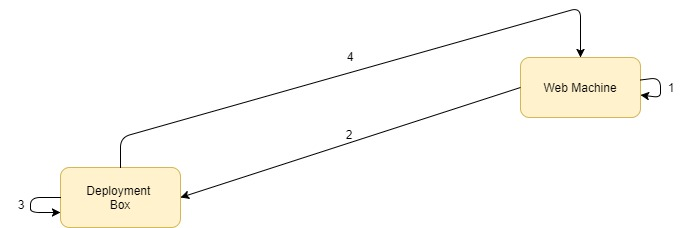

# Encrypt.Config
[](https://github.com/Supercide/Encrypt.Config/tree/master)

JSON Configuration encryption tool

## What is Encrypt.Config

In production environments, configuration files will more than likely contain sensitive information. Encrypt.Config is a tool designed to help protect JSON based configuration files by encrypting them. When used in combination with [Decrypt.Config](#TODO) an ASP Core application will be able to use encrypted configuration files, decrypting values on access. Encrypt.Config does this by first Creating a public and private key on the machine where you want to store the encrypted configuration file. You then export the public key and use it to encrypt the configuration file. For more information on how this works [click here](#TODO)

## How to use



1. First [Create the Private and public keys](#TODO) supplying the identity of the application whose configuration files need to be encrypted

2. [Export the public key](#TODO) to a location where the encryption will take place (this may be your deployment server or build server, its typically the place where configuration file transformation happens)

3. After configuration files have been transformed, [encrypt the configuration file](#TODO) with Encrypt.Config using the public key exported in step 2

4. Deploy the configuration file and run the application, everything should work as if the configuration file wasn't encrypted as long as [Decrypt.Config has been set up](#TODO)

## Commands

### Create public and private keys and store them in a container

`create keys -u <Application_Identity> -n <Name_Of_Key_Container>`

When your keys are created they are stored in a key container located at `C:\ProgramData\Microsoft\Crypto\RSA\MachineKeys`. Only the assigned identity will have access to this container as a access control rule is applied to this container via [NTFS ACL]() . Key containers provide the most secure way of storing cryptographic keys more information regarding key containers can be found [here](https://msdn.microsoft.com/library/9a179f38-8fb7-4442-964c-fb7b9f39f5b9)

### Create keys and export public key: 

The exported public key is used to encrypted the json configuratiopn file, only the private key can decrypt this file.

`create keys -u <Application_Identity> -n <Name_Of_Key_Container> -o <Public_Key_Out_Path_And_Filename>`

the output should generate a file simmilar to the one below

```

```