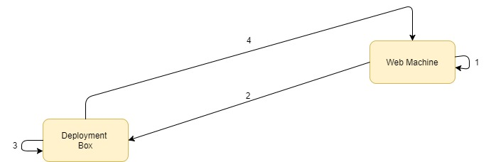

# Encrypt.Config

JSON Configuration encryption tool
## Table of contents
- [Read Me](./readme.md)
- [Architecture](./docs/Architecture.md)
- Instruction Manual
    - [Creating Keys](./docs/CreatingKeys.md)
    - [Exporting Keys](./docs/ExportingKeys.md)
    - [Encrypting](./docs/Encryption.md)

## What is Encrypt.Config

In production environments, configuration files will more than likely contain sensitive information. Encrypt.Config is a tool designed to help protect JSON based configuration files by encrypting them. When used in combination with [Decrypt.Config](https://github.com/Supercide/Decrypt.Config) an ASP Core application will be able to use encrypted configuration files. Encrypt.Config does this by first Creating a public and private key on the machine where you want to store the encrypted configuration file. You then export the public key and use it to encrypt the configuration file. More information on how this works below 

# Getting Started 
Check out the [Docs](/docs) folder for instructions on how to use the application 

## How it works

1. [Create](/docs/creatingkeys.md) the RSA Private and public keys on the machine where the encrypted configuration files need to be stored.

2. [Export](/docs/exportingkeys.md) the public key. When encrypting the configuration file you will need to supply the public key creating in step 1.

3. [Encrypt](/docs/encryption.md) the configuration file with Encrypt.Config using the public key exported in step 2. this should produce an encrypted file and a `decryptionkey`. To decrypt the file wou will need the private key we created in step 1 along with the `decryptionkey` we just created.

4. Deploy the configuration file and run the application, everything should work as if the configuration file wasn't encrypted as long as [Decrypt.Config](https://github.com/Supercide/Decrypt.Config)  has been set up in the web application.

# License

https://opensource.org/licenses/GPL-3.0